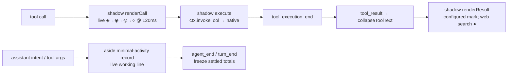
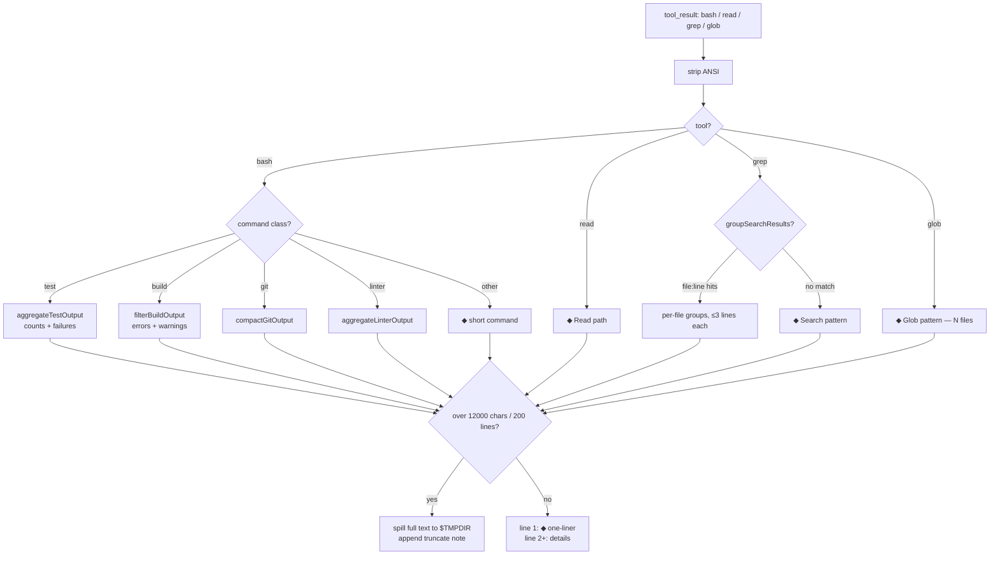
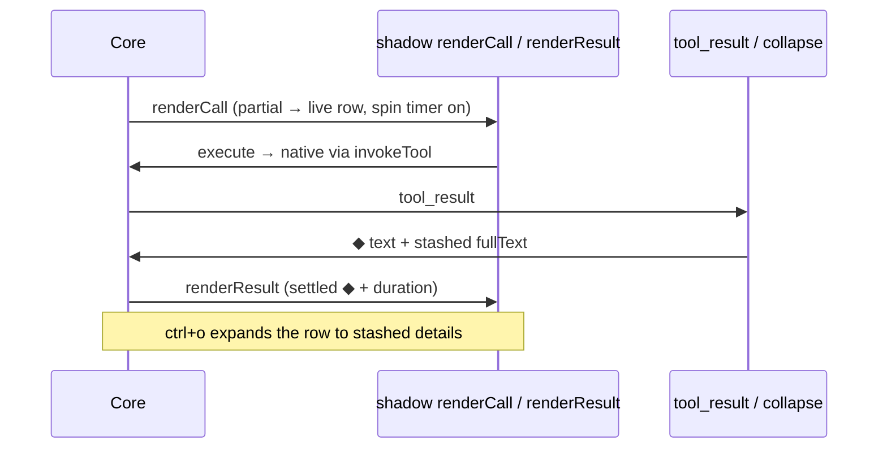

# omp-minimal-output

Grok-build-style minimal console output for omp. Dedicated cards use theme-derived settled marks (`●`) and no background fill; general rows use the configured indicator. `ctrl+o` (`app.tools.expand`) toggles expansion globally. Rows are not clickable because row input remains core-owned.

Wrapped Grep merges call and result into one row. AST Grep, LSP, Debug, Task, and Hub keep native registrations, schemas, approvals, execution, and result details; the display-only skin projects native component state into the same minimal card language.

Install: `omp install ./omp-minimal-output` (or `--extension ./omp-minimal-output/index.ts --config ./omp-minimal-output/minimal-output.yml`).

Commands: `/minimal-on`, `/minimal-off`, `/minimal-status`, `/minimal-gallery`.

## Card settings

| Card | Native fallback | Expanded limit |
| --- | --- | --- |
| Web search | `nativeWebSearch` (default `false`) | `webSearchMaxResults` (default `5`, range `1..10`) |
| Grep | `nativeGrep` (default `false`) | `grepMaxMatches` (default `5`, range `1..20`) |
| AST Grep | `nativeAstGrep` (default `false`) | `astGrepMaxMatches` (default `5`, range `1..20`) |
| LSP | `nativeLsp` (default `false`) | `lspMaxItems` (default `5`, range `1..10`) |
| Debug | `nativeDebug` (default `false`) | `debugMaxItems` (default `5`, range `1..10`) |
| Task | `nativeTask` (default `false`) | `taskMaxAgents` (default `4`, range `1..8`) |
| Hub | `nativeHub` (default `false`) | `hubMaxItems` (default `5`, range `1..10`) |

Each fallback is independent. Native fallbacks restore the host renderer and leave that tool's result text untouched. AST Grep, LSP, Debug, Task, and Hub are never shadow-registered.

## Manual card gallery

`/minimal-gallery` mounts deterministic fixtures above the editor using the real card renderers, current theme, and current terminal width. It does not execute the underlying tools.

```text
/minimal-gallery                         # every card, expanded state
/minimal-gallery all success             # every settled success card
/minimal-gallery all error               # every failure card
/minimal-gallery all running             # every animated running card
/minimal-gallery lsp expanded             # one card
/minimal-gallery ast error
/minimal-gallery debug success
/minimal-gallery off                     # remove the gallery
```

Cards: `web`, `grep`, `ast`, `lsp`, `debug`, `task`, `hub`. States: `running`, `success`, `error`, `expanded`. The gallery verifies presentation; invoke a real tool separately only when testing host integration or native fallback.

## Runtime overview



Eight shadows (`bash`, `read`, `grep`, `glob`, `write`, `edit`, `eval`, `web_search`) delegate to native execution with native schemas. Task and Hub are not shadows: `native-tool-card-skin.ts` observes public `ToolExecutionComponent` updates, renders only verified Task/Hub state, and fails open to the native renderer. `web_search` shows source count/provider and expands to bold titles with dim URLs; `edit` renders a compact gutter diff and `eval` replaces the boxed output panel.

Thoughts are fully hidden (`registerAssistantThinkingRenderer` is supplemental-only). Spill files land in `$TMPDIR/omp-minimal-*.log`.

Pulse: working rows cycle `◈ → ◉ → ◎ → ○` at 120 ms via managed `ctx.setInterval` while a tool runs. General rows settle to the configured indicator; web search settles to `●` and uses the error token on failure. `/minimal-off` mid-run stops the pump immediately. `minimal-output.yml` (`shimmer: disabled`, `showProgress: false`) is untouched.

Background: `Container` is a passthrough and `Text` paints no fill unless given a custom bg fn (never called here); core also clears the wrapper bg (`setBgFn(undefined)`) for custom `renderCall`/`renderResult`. The only filled rows were native `grep`/`glob` ones (`toolSuccessBg` via the native renderer) — both are now shadowed to the same single-`Container` shape as `bash`/`read`.

## Collapse pipeline (`filters.ts`)



Contract: ordinary rewritten results keep a settled one-liner on line 1 with filtered details below it. Dedicated cards (`edit`, `eval`, `web_search`, Grep, AST Grep, LSP, Debug, Task, Hub) use stashed text and preserved structured details for expansion.

Grep and AST Grep show bounded matches grouped by file. LSP emphasizes action, symbol or file, and result count. Debug emphasizes action, target, debugger state, and bounded result rows. Task reads native `progress`/`results`; Hub reads native coordination/process details.

## Row lifecycle



Grouped tools share one parent row (`toolGroups` by fingerprint; lead paints the group, siblings return empty framed blocks). Settled records freeze `label/total/runId` in message details so rebuilds and resumed sessions never mirror a later run; only the current turn's live row follows shared module state.

## Files

- `index.ts` — extension entry: wrapped cards plus display-only AST Grep/LSP/Debug/Task/Hub, read-group, warning, and todo skins; lifecycle and `/minimal-on|off|status`.
- `card-primitives.ts` — shared lifecycle, sanitation, header, detail, error, and limit mechanics.
- `search-card.ts`, `lsp-card.ts`, `debug-card.ts`, `task-card.ts`, `hub-card.ts` — tool-specific projections; `native-tool-card-skin.ts` is their fail-open host bridge; `card-gallery.ts` holds deterministic fixtures.
- `edit-card.ts`, `eval-card.ts`, `web-search-card.ts` — dedicated wrapped-tool cards. `todos-header.ts` and `todo-hud.ts` own todo chrome.
- `text.ts`, `theme.ts`, `results.ts`, `loaders.ts` — string helpers, theme clocks, result identities, and lazy core affordances. `filters.ts` owns pure output filters.
- `minimal-output.yml` — `hideThinkingBlock`, `hideToolActivity`, `shimmer: disabled`, `showProgress: false`, `tui.tight`, `statusLine.minimal`.
- `package.json` — `@local/omp-minimal-output`, extension entry `./index.ts`.

## Constraints

- `tryWrapTool` allowlist is `bash/read/grep/glob/edit/write/eval/web_search`; never add an unsupported shadow.
- AST Grep, LSP, Debug, Task, and Hub stay native. The skin may observe public render lifecycle methods, but must never replace schemas, execution, debugger state, LSP mutations, Task runtime schemas, or Hub's argument-dependent approval policy.
- Shadows are transparent delegates: no behavior change to what tools do, only how rows render.
- Agent rules (`AGENTS.md`): prefer `read`/`grep`/`glob` over shell pipelines; one verification per change; one short intent line per tool call.
