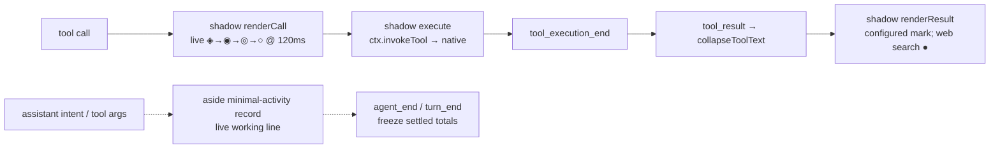
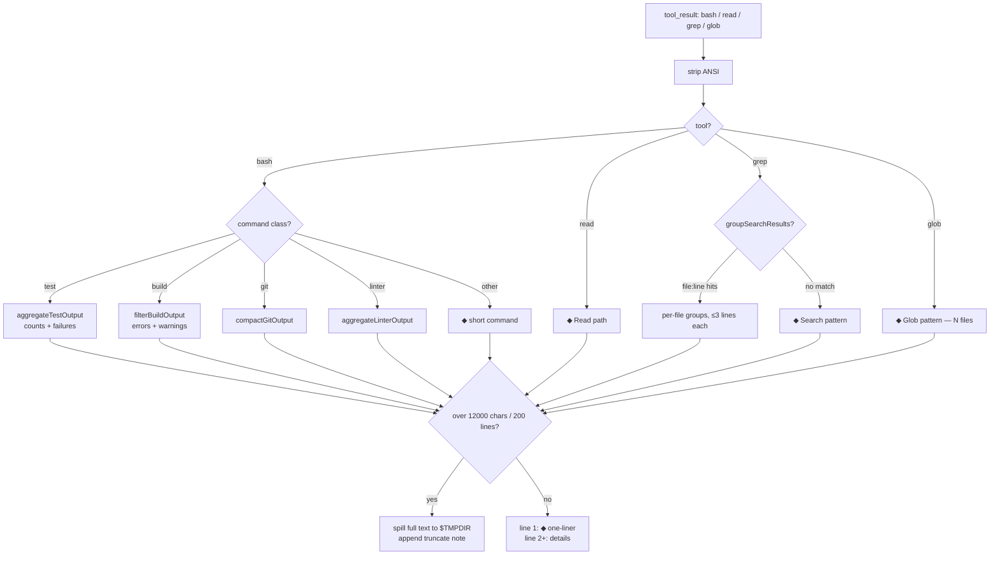
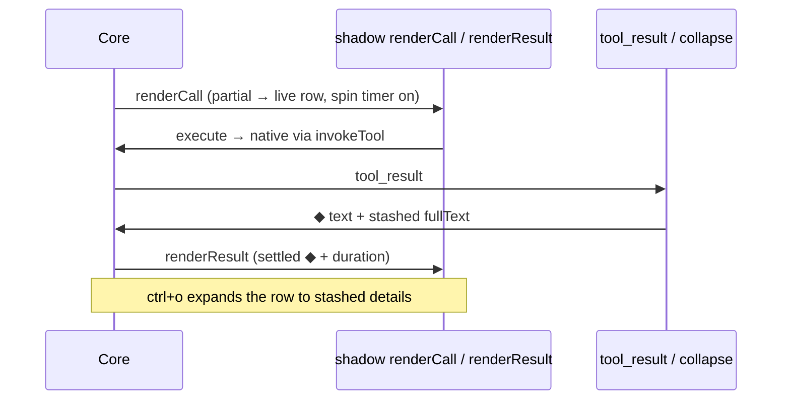

# omp-minimal-output

Grok-build-style minimal console output for omp. Collapsed rows use theme-derived settled marks (`●` for web search; the configured indicator elsewhere) with no background fill; `ctrl+o` (`app.tools.expand`) toggles expansion globally. Rows are not clickable: row input is core-owned and custom renderers are display-only, so there is no per-row click path.

Single row per tool: shadows set `mergeCallAndResult: true` (same as native single-row tools), so a settled tool replaces its pending call row instead of stacking below it. Web search settles to `●`; other rows retain their configured settled indicator.

Install: `omp install ./omp-minimal-output` (or `--extension ./omp-minimal-output/index.ts --config ./omp-minimal-output/minimal-output.yml`).

Commands: `/minimal-on`, `/minimal-off`, `/minimal-status`.

## Runtime overview

Eight shadows (`bash`, `read`, `grep`, `glob`, `write`, `edit`, `eval`, `web_search`): native `description` + `parameters` copied verbatim (never hand-written — a lossy schema hides fields from the model; this once broke `write` by dropping `content`), `execute` delegates to the native tool via `ctx.invokeTool`, and custom renderers only change presentation. `web_search` renders an animated query row that settles to `●`, shows source count and provider, and expands to bold `╰─` titles with dim URLs; snippets remain in the stashed raw result. `edit` renders a compact gutter diff and `eval` replaces the native boxed output panel.

Thoughts are fully hidden (`registerAssistantThinkingRenderer` is supplemental-only). Spill files land in `$TMPDIR/omp-minimal-*.log`.

Pulse: working rows cycle `◈ → ◉ → ◎ → ○` at 120 ms via managed `ctx.setInterval` while a tool runs. General rows settle to the configured indicator; web search settles to `●` and uses the error token on failure. `/minimal-off` mid-run stops the pump immediately. `minimal-output.yml` (`shimmer: disabled`, `showProgress: false`) is untouched.

Background: `Container` is a passthrough and `Text` paints no fill unless given a custom bg fn (never called here); core also clears the wrapper bg (`setBgFn(undefined)`) for custom `renderCall`/`renderResult`. The only filled rows were native `grep`/`glob` ones (`toolSuccessBg` via the native renderer) — both are now shadowed to the same single-`Container` shape as `bash`/`read`.

## Collapse pipeline (`filters.ts`)

Contract: ordinary rewritten results keep a settled one-liner on line 1 and filtered details below it. Dedicated cards (`edit`, `eval`, `web_search`) read the stashed pre-collapse result from `details.minimalFullText` and decide their own collapsed/expanded presentation.

Search: `grep` input is `{path, pattern}`, `glob` input is `{path}` (probed live). `web_search` reads structured `details.response.provider` and `details.response.sources`, shows at most `webSearchMaxResults` sources, and retains the complete result in `minimalFullText`; `nativeWebSearch` restores the native renderer. Shadow schemas are the native ones verbatim, so every native option remains visible to the model.

## Row lifecycle

Grouped tools share one parent row (`toolGroups` by fingerprint; lead paints the group, siblings return empty framed blocks). Settled records freeze `label/total/runId` in message details so rebuilds and resumed sessions never mirror a later run; only the current turn's live row follows shared module state.

## Files

- `index.ts` — extension entry: 8 shadows, `minimal-activity` + `skill-prompt` message renderers, event handlers (`session_start`, `before_agent_start`, `tool_result`, `tool_execution_start/end`, `message_update`, `agent_end`, `turn_end`), group/activity/thought rows, `/minimal-on|off|status`.
- `todos-header.ts` — parse/paint live todos for the sticky widget. `todo-hud.ts` — hide the native TODO HUD (`todoHud`, default off) and paint the transcript todo card from the same live snapshot.
- `text.ts` — pure label/wrap/truncate string helpers. `theme.ts` — theme colors, render clocks, `formatRowLine`. `results.ts` — result-shape readers and fingerprints. `loaders.ts` — lazy core affordances. `edit-card.ts` — compact edit diff card. `eval-card.ts` — borderless eval output card. `web-search-card.ts` — provider-aware source card.
- `filters.ts` — pure string filters, zero dependencies (`collapseToolText`, per-class aggregators, `MAX_CHARS`/`MAX_LINES` truncation).
- `minimal-output.yml` — `hideThinkingBlock`, `hideToolActivity`, `shimmer: disabled`, `showProgress: false`, `tui.tight`, `statusLine.minimal`.
- `package.json` — `@local/omp-minimal-output`, extension entry `./index.ts`.

## Constraints

- `tryWrapTool` allowlist is `bash/read/grep/glob/edit/write/eval/web_search`. Each entry has a verified `ctx.invokeTool` delegation path; never add another tool without proving delegation first, because registering an unsupported shadow replaces the working native tool.
- Shadows are transparent delegates: no behavior change to what tools do, only how rows render.
- Agent rules (`AGENTS.md`): prefer `read`/`grep`/`glob` over shell pipelines; one verification per change; one short intent line per tool call.
