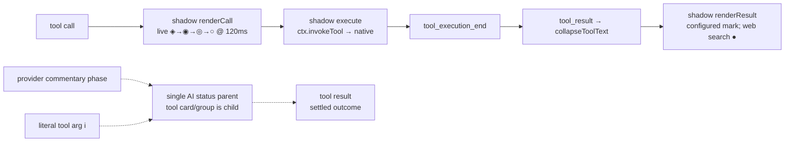
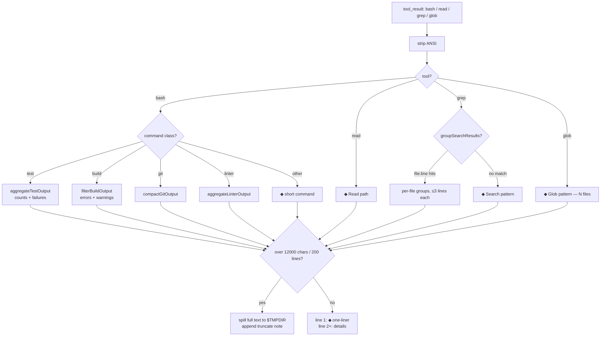
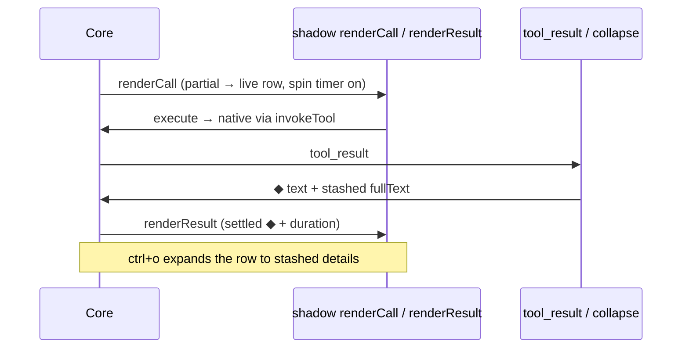

# omp-minimal-output

Grok-build-style minimal console output for omp. Collapsed rows use theme-derived settled marks (`●` for web search, Task, and Hub; the configured indicator elsewhere) with no background fill; `ctrl+o` (`app.tools.expand`) toggles expansion globally with a configurable 20-content-line default allowance per section. Rows are not clickable: row input is core-owned and custom renderers are display-only, so there is no per-row click path. `/inspect` (or `ctrl+alt+i`) opens a Rewind-like fullscreen replica; ↑/↓ outlines one tool card, Enter expands that replica only, and Esc closes without rewriting transcript scrollback.

Wrapped tools merge call and result into one row. Task and Hub keep their native registrations, schemas, approvals, execution, and result details; a display-only skin projects their native component state into the same minimal card language.

Generic grouped tools keep output indented beneath each tool, with continuation rails only between sibling tools. Unlabeled tools retain a settled `●` indicator. Trailing blank output rows are removed; interior blanks and source indentation are preserved. Each execution owns its output allowance; parent/tool headers and omission hints do not consume content lines or hide later tool headers. Piped bash and eval output without TTY colors (`git diff`, `bun test`) is semantically colored: additions and passes in success, deletions and failures in error, hunk headers in accent. Existing ANSI from a PTY or `--color=always` passes through.

Install: `omp install ./omp-minimal-output` (or `--extension ./omp-minimal-output/index.ts --config ./omp-minimal-output/minimal-output.yml`).

Commands: `/minimal-on`, `/minimal-off`, `/minimal-status`, `/todos-show`, `/todos`, `/inspect`, `/demo-write`, `/demo`, `/demo-all`; shortcut `ctrl+alt+t` toggles Todo expand/collapse; `ctrl+alt+i` opens the inspect overlay.

Development demo: `/demo` (or `/demo-all`) runs a live interactive showcase of minimal cards and surfaces without LLM or network requests. Inspect individual components via `/demo <write|edit|eval|grouped|grep|image|task|hub|todo|search>` or dismiss early with `/demo stop`.

Inspect overlay: `/inspect` (or `ctrl+alt+i`) replays this session's tool cards fullscreen with the same plugin chrome as the transcript.

- **Full expansion**: Enter (or `l`) expands everything without the 20-line limit, revealing complete outputs.
- **1-line minimize**: `m` toggles the focused card down to a single-line summary; `M` minimizes/restores all cards.
- **Fast search**: `/` opens an instant search across tool names, arguments, outputs, and user prompts. `n` steps to the next match, `N` to the previous match, `Enter` commits, and `Esc` clears the search.
- **Images**: Read image cards show a clean placeholder box in the transcript and render full graphic pixels in inspect view when expanded.
- **Navigation**: ↑/↓ (or `j`/`k`) steps between cards, `h` collapses, and `Esc` closes without rewriting transcript scrollback.

Configurable detail levels: [`docs/DETAIL_LEVELS.md`](docs/DETAIL_LEVELS.md).

`standardMaxRows` (default `3`) bounds input content and `standardOutputMaxRows` (default `4`) independently bounds output content. `standardWriteMaxRows` (default `10`) retains the latest Write content lines; Edit retains `standardEditRowsPerFile` (default `10`) diff/context lines per file. Headers, separators, and omission hints are additional rows. `detailedMaxRows` (default `20`) applies per input/output section or Edit file in Detailed and Ctrl+O, not to the assembled card height. Search, Task, Hub, and native read groups select complete items instead of slicing their rendered rows. Opaque native cards retain native Standard/Detailed rendering because their content boundaries are not exposed.

## Input composer styles

The plugin registers four choices in `/settings` → **Composer Shape**:

- **Minimal Output · Bottom Dock** — project and Git state in the top-right rule; live spinner and elapsed time plus provider usage and context gauge in the bottom rule, with native Plan stripped from both rules.
- **Minimal Output · Top Dock** — the complete configured status line in the top rule (live spinner, elapsed time, native model, effort, usage, context, project, and Git), with duplicate native model copies collapsed to one and every native Plan copy stripped.
- **Minimal Output · Grayscale Bottom Dock** — the Bottom Dock layout with all prompt chrome, status, gauge, and mode colors collapsed to the neutral frame color.
- **Minimal Output · Grayscale Top Dock** — the Top Dock layout with the same neutral grayscale treatment.

The original Bottom Dock and Top Dock styles preserve OMP's live `statusLine.*` theme colors. The two Grayscale styles strip inherited ANSI colors from the prompt chrome and repaint the full frame with explicit equal-RGB grays: darker rules, medium status text, and a brighter neutral prompt gutter. Editor text remains unchanged. Both docks prefix the working head ahead of project/Git while a run is active: the configured indicator frame plus elapsed run time (`12s`/`2m`/`3h`), with no prefix when idle. The native model name stays exactly where OMP emits it; only a duplicated second copy is removed, so the model appears once. Provider usage formats concisely to the primary window (showing `5h` if present, otherwise `7d`, never both), displaying remaining quota left ($100\% - \text{used}\%$) while retaining the reset countdown timer. While idle at the prompt, composer chrome auto-refreshes periodically (`composerRefreshInterval`, default `60` seconds, range `1..3600`) to keep reset countdowns and provider quota current without requiring user interaction.

## Card settings

| Card       | Native fallback                     | Standard item selection                            |
| ---------- | ----------------------------------- | -------------------------------------------------- |
| Web search | `nativeWebSearch` (default `false`) | `webSearchMaxResults` (default `5`, range `1..10`) |
| Task       | `nativeTask` (default `false`)      | `taskMaxAgents` (default `4`, range `1..8`)        |
| Hub        | `nativeHub` (default `false`)       | `hubMaxItems` (default `5`, range `1..10`)         |

Each fallback is independent. `nativeTask` and `nativeHub` restore the host renderer and leave result text untouched; the plugin never shadow-registers either tool.

## Runtime overview

Grouped and dedicated wrapped cards dispatch through `cards/card-registry.ts`. Renderer failures use OMP's native fallback rather than hiding the transcript. The five native surface skins share one `core/container-interceptor.ts` hook; `/minimal-off` removes its subscribers and `/minimal-on` reinstalls them. Task and Hub remain native tools.

Provider-tagged commentary (`textSignature.phase = "commentary"`) wins over literal tool argument `i`, which wins over generated labels. `surfaces/assistant-commentary-skin.ts` blanks the original native display block because OMP splits tool calls into separate timeline components; the label is projected into the owning tool surface while agent context and persisted message content remain verbatim.

The sticky Todo widget hydrates as one collapsed summary row on session start only when the current session already has a nonempty todo list. Expanding it shows the full retained list; `standardMaxRows` does not apply to Todo. Empty new sessions keep the widget absent until a todo tool result creates work.

Eight shadows (`bash`, `read`, `grep`, `glob`, `write`, `edit`, `eval`, `web_search`) delegate to native execution with native schemas. Task and Hub are not shadows: `cards/native-tool-card-skin.ts` observes public `ToolExecutionComponent` updates, renders only verified Task/Hub state, and fails open to the native renderer. Write shows a bounded, path-aware syntax-highlighted input preview while running and settled; `web_search` shows source count/provider and expands to bold titles with dim URLs; expanded `edit` cards use project-relative file branches, per-file stats, continuation rails, explicit diff markers, and hunk separators; `eval` replaces the boxed output panel.

The literal tool argument `i` is never discarded. Generic wrapped tools (`bash`, `read`, `grep`, `glob`) keep the grouped status parent and tool children. Dedicated/native cards (`write`, `edit`, `eval`, `web_search`, Task, Hub) render the AI status as a parent and the named card as its indicator-free `╰─` child. Todo settles into the sticky widget or native fallback. Live `minimal-activity` records remain only for surfaces without an owning group/card; the plugin emits no second settled activity row.

The sticky Todo widget is the single Todo surface after a successful widget mount. Its native transcript card is suppressed only while that widget is active; headless, disabled, or failed widget mounts retain the transcript card as the safe fallback.

Live reasoning streams in the animated widget above the composer; `registerAssistantThinkingRenderer` is supplemental-only. With `hideThinkingBlock: true` (the shipped `minimal-output.yml`), the native thinking block is hidden and settled thought rows are suppressed from the transcript. Spill files land in `$TMPDIR/omp-minimal-*.log`.

Pulse: working rows cycle `◈ → ◉ → ◎ → ○` at 120 ms via managed `ctx.setInterval` while a tool runs. General rows settle to the configured indicator; web search settles to `●` and uses the error token on failure. `/minimal-off` mid-run stops the pump immediately. `minimal-output.yml` (`shimmer: disabled`, `showProgress: false`) is untouched.

Background & padding: `Container` is a passthrough and `Text` paints no fill unless given a custom bg fn (never called here). Tool execution wrappers and read groups enforce `setBgFn(undefined)` and a consistent 1-character horizontal padding (`setPaddingX(1)`), keeping output readable, aligned, and free of rectangular background fills (`toolSuccessBg`/`toolErrorBg`) even when OMP re-applies `stateBgFn`.

## Collapse pipeline (`core/filters.ts`)

Contract: ordinary rewritten results keep a settled one-liner on line 1 and filtered details below it. Dedicated cards (`edit`, `eval`, `web_search`, Task, Hub) use stashed text or preserved structured native details for expansion.

Task and Hub use their native `progress`/`results` details. Standard selection is bounded by `taskMaxAgents` and `hubMaxItems`; Detailed ignores those item limits. `nativeTask` and `nativeHub` keep native result text uncollapsed and bypass plugin density rendering.

## Row lifecycle

Grouped tools share one parent row (`toolGroups` by fingerprint; lead paints the group, siblings return empty framed blocks). Settled records freeze `label/total/runId` in message details so rebuilds and resumed sessions never mirror a later run; only the current turn's live row follows shared module state.

The interactive extension uses one process-global runtime lease, acquired only when `session_start` reports `hasUI`. Headless subagent, print, and JSON sessions retain native tool behavior and never acquire the lease, install skins/widgets, or mutate the parent's presentation state. A replacement UI session disposes the previous generation's widgets, timer, editor, and interceptor subscribers before activating its own callbacks; wrapped tools are registered afresh for the replacement.

## Files

- `index.ts` — extension entry: registration, event orchestration, and top-level lifecycle only; formatting and parsing live in owned modules.
- `core/` — `tool-wrapper.ts` (native interception, single-pass delegation), `activity-tracker.ts` (intent ranking, parent labels), `animation-pump.ts` (120ms tick, idle detection), `container-interceptor.ts` (single `addChild` seam for all five skins), `config.ts` (settings schema, lockfile + project overrides), `theme.ts`/`text.ts`/`density.ts`/`results.ts`/`loaders.ts`/`filters.ts`/`runtime-owner.ts`.
- `cards/` — `card-registry.ts` (unified dispatch for grouped and dedicated cards), `grouped-tool-card.ts` (bash/read/grep/glob rows and rails), dedicated cards (`write`, `edit`, `eval`, `web_search`, `task`, `hub`), `native-tool-card-skin.ts` (fail-open Task/Hub bridge), `card-primitives.ts`, `card-gallery.ts`.
- `surfaces/` — `composer-shapes.ts` (four prompt docks + custom editor, `composerRefreshInterval` polling), `thinking-widget.ts`, `todo-widget.ts`/`todos-header.ts`/`todo-hud.ts`, `commands.ts` (slash commands + shortcut), warning/assistant-commentary/read-group skins, `scrolling-text.ts`.
- `minimal-output.yml` — `hideThinkingBlock`, `hideToolActivity`, `shimmer: disabled`, `showProgress: false`, `tui.tight`, `statusLine.minimal`, and embedded context gauge.
- `package.json` — `@local/omp-minimal-output`, extension entry `./index.ts`, user-facing settings metadata.

## Constraints

- `tryWrapTool` allowlist is `bash/read/grep/glob/edit/write/eval/web_search`; never add an unsupported shadow.
- Task and Hub stay native. Their skin may observe public render lifecycle methods, but must never copy or replace Task's runtime schema or Hub's argument-dependent approval policy.
- Shadows are transparent delegates: no behavior change to what tools do, only how rows render.
- Agent rules (`AGENTS.md`): prefer `read`/`grep`/`glob` over shell pipelines; one verification per change; one short intent line per tool call.
