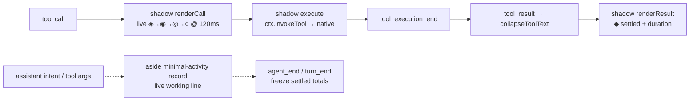
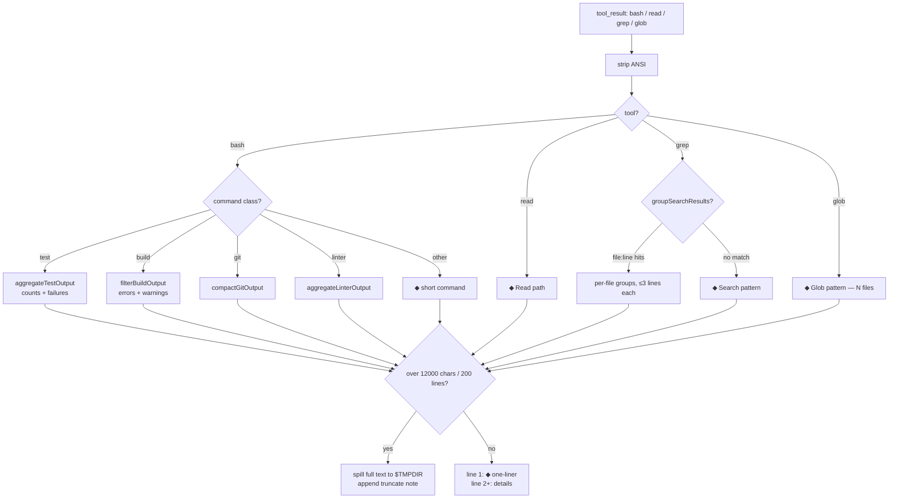
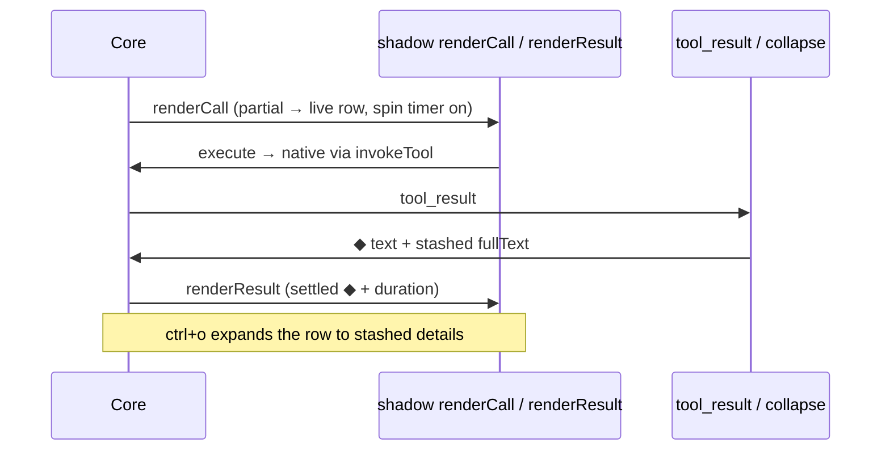

# omp-minimal-output

Grok-build-style minimal console output for omp. Collapsed `◆` rows with no background fill (plain terminal background); `ctrl+o` (`app.tools.expand`) toggles expansion globally. Rows are not clickable: row input is core-owned and custom renderers are display-only, so there is no per-row click path.

Single row per tool: shadows set `mergeCallAndResult: true` (same as native single-row tools), so a settled tool shows only its `◆` result row — the pending `◈` call row is replaced, never stacked below it.

Install: `omp install ./omp-minimal-output` (or `--extension ./omp-minimal-output/index.ts --config ./omp-minimal-output/minimal-output.yml`).

Commands: `/minimal-on`, `/minimal-off`, `/minimal-status`.

## Runtime overview

Five shadows (`bash`, `read`, `grep`, `glob`, `write`): same schemas plus `.passthrough()`, `execute` delegates to the native tool, `renderCall` paints the live row, `renderResult` paints the settled row with dim right-side duration (`durationSuffix`) and error styling (`isToolError`). `edit` stays native (diff fidelity). Collapse covers 25 built-ins plus MCP rows (single-line `◇` one-liners, envelope dupes pruned); grouped tools share a `●` parent with `├─`/`╰─` children, full text stashed for expansion.

Thoughts are fully hidden (`registerAssistantThinkingRenderer` is supplemental-only). Spill files land in `$TMPDIR/omp-minimal-*.log`.

Pulse: the working line cycles `◈ → ◉ → ◎ → ○` at 120 ms via managed `ctx.setInterval` while a tool runs, then settles to `◆`; `/minimal-off` mid-run stops it immediately. `minimal-output.yml` (`shimmer: disabled`, `showProgress: false`) is untouched.

Background: `Container` is a passthrough and `Text` paints no fill unless given a custom bg fn (never called here); core also clears the wrapper bg (`setBgFn(undefined)`) for custom `renderCall`/`renderResult`. The only filled rows were native `grep`/`glob` ones (`toolSuccessBg` via the native renderer) — both are now shadowed to the same single-`Container` shape as `bash`/`read`.

## Collapse pipeline (`filters.ts`)

Contract: line 1 of every rewritten text is the `◆` settled one-liner (the transcript's collapsed row); filtered details follow from line 2, so ENTER expands a row to details and collapses back to the one-liner. Full pre-collapse text is stashed in result details so `ctrl+o` shows everything.

Search: `grep` input is `{path, pattern}`, `glob` input is `{path}` (probed live); schemas mirror that plus `.passthrough()`. `glob` collapses to `` ◆ glob `<pattern>` — <N> files ``; `grep` keeps its `file:line:col` grouping when the output matches, else the generic one-liner (native grep emits `# file` / `*line:` sections, which take the generic path).

## Row lifecycle

Grouped tools share one parent row (`toolGroups` by fingerprint; lead paints the group, siblings return empty framed blocks). Settled records freeze `label/total/runId` in message details so rebuilds and resumed sessions never mirror a later run; only the current turn's live row follows shared module state.

## Files

- `index.ts` — extension entry: 5 shadows, `minimal-activity` + `skill-prompt` message renderers, event handlers (`session_start`, `before_agent_start`, `tool_result`, `tool_execution_start/end`, `message_update`, `agent_end`, `turn_end`), spin/fade/group painting, `/minimal-on|off|status`.
- `filters.ts` — pure string filters, zero dependencies (`collapseToolText`, per-class aggregators, `MAX_CHARS`/`MAX_LINES` truncation).
- `minimal-output.yml` — `hideThinkingBlock`, `hideToolActivity`, `shimmer: disabled`, `showProgress: false`, `tui.tight`, `statusLine.minimal`.
- `package.json` — `@local/omp-minimal-output`, extension entry `./index.ts`.

## Constraints

- `tryWrapTool` allowlist is `bash/read/grep/glob/edit/write` only. Re-registering any other tool cannot delegate (no original handle; `ctx.invokeTool` is built-in-only), so wrapping e.g. MCP tools (`mcp__*`) breaks them with `minimal-output: native <name> unavailable`. Never widen the allowlist without a working delegation path.
- Shadows are transparent delegates: no behavior change to what tools do, only how rows render.
- Agent rules (`AGENTS.md`): prefer `read`/`grep`/`glob` over shell pipelines; one verification per change; one short intent line per tool call.
