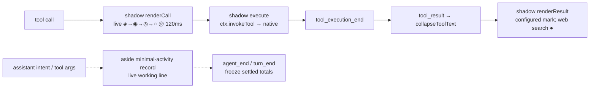
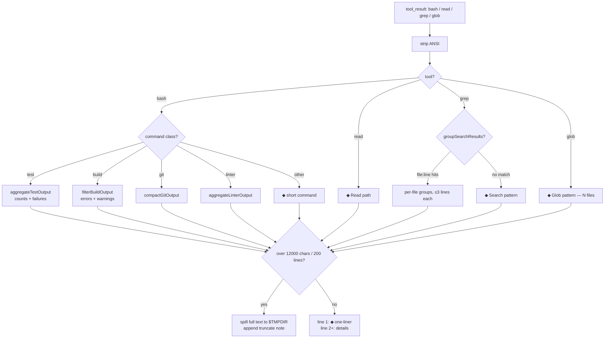
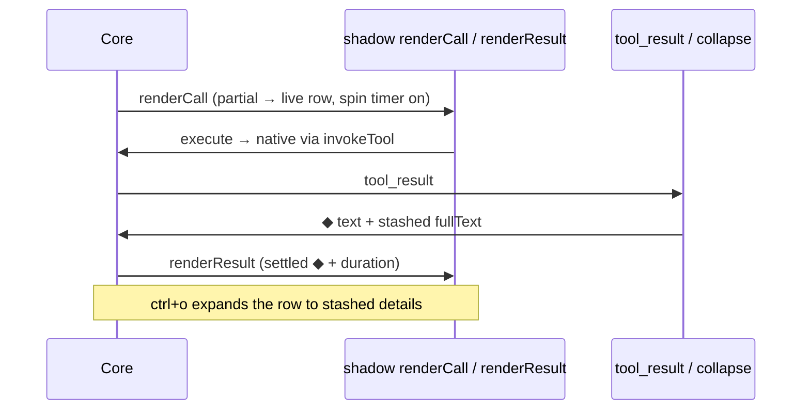

# omp-minimal-output

Grok-build-style minimal console output for omp. Collapsed rows use theme-derived settled marks (`●` for web search, Task, and Hub; the configured indicator elsewhere) with no background fill; `ctrl+o` (`app.tools.expand`) toggles expansion globally. Rows are not clickable: row input is core-owned and custom renderers are display-only, so there is no per-row click path.

Wrapped tools merge call and result into one row. Task and Hub keep their native registrations, schemas, approvals, execution, and result details; a display-only skin projects their native component state into the same minimal card language.

Install: `omp install ./omp-minimal-output` (or `--extension ./omp-minimal-output/index.ts --config ./omp-minimal-output/minimal-output.yml`).

Commands: `/minimal-on`, `/minimal-off`, `/minimal-status`.

## Card settings

| Card | Native fallback | Expanded limit |
| --- | --- | --- |
| Web search | `nativeWebSearch` (default `false`) | `webSearchMaxResults` (default `5`, range `1..10`) |
| Task | `nativeTask` (default `false`) | `taskMaxAgents` (default `4`, range `1..8`) |
| Hub | `nativeHub` (default `false`) | `hubMaxItems` (default `5`, range `1..10`) |

Each fallback is independent. `nativeTask` and `nativeHub` restore the host renderer and leave result text untouched; the plugin never shadow-registers either tool.

## Runtime overview

Eight shadows (`bash`, `read`, `grep`, `glob`, `write`, `edit`, `eval`, `web_search`) delegate to native execution with native schemas. Task and Hub are not shadows: `native-tool-card-skin.ts` observes public `ToolExecutionComponent` updates, renders only verified Task/Hub state, and fails open to the native renderer. `web_search` shows source count/provider and expands to bold titles with dim URLs; `edit` renders a compact gutter diff and `eval` replaces the boxed output panel.

Thoughts are fully hidden (`registerAssistantThinkingRenderer` is supplemental-only). Spill files land in `$TMPDIR/omp-minimal-*.log`.

Pulse: working rows cycle `◈ → ◉ → ◎ → ○` at 120 ms via managed `ctx.setInterval` while a tool runs. General rows settle to the configured indicator; web search settles to `●` and uses the error token on failure. `/minimal-off` mid-run stops the pump immediately. `minimal-output.yml` (`shimmer: disabled`, `showProgress: false`) is untouched.

Background: `Container` is a passthrough and `Text` paints no fill unless given a custom bg fn (never called here); core also clears the wrapper bg (`setBgFn(undefined)`) for custom `renderCall`/`renderResult`. The only filled rows were native `grep`/`glob` ones (`toolSuccessBg` via the native renderer) — both are now shadowed to the same single-`Container` shape as `bash`/`read`.

## Collapse pipeline (`filters.ts`)

Contract: ordinary rewritten results keep a settled one-liner on line 1 and filtered details below it. Dedicated cards (`edit`, `eval`, `web_search`, Task, Hub) use stashed text or preserved structured native details for expansion.

Task reads native `progress`/`results` and limits expanded rows with `taskMaxAgents`. Hub reads native coordination/process details and limits expanded rows with `hubMaxItems`. `nativeTask` and `nativeHub` keep native result text uncollapsed.

## Row lifecycle

Grouped tools share one parent row (`toolGroups` by fingerprint; lead paints the group, siblings return empty framed blocks). Settled records freeze `label/total/runId` in message details so rebuilds and resumed sessions never mirror a later run; only the current turn's live row follows shared module state.

Extension generations use one process-global runtime lease. A hot reload disposes the previous generation's widgets, timer, and prototype skins before the replacement registers callbacks; stale renderers remain fail-open and cannot hide core transcript input.

## Files

- `index.ts` — extension entry: 8 shadows plus display-only Task/Hub, read-group, warning, todo skins; lifecycle handlers; `/minimal-on|off|status`. `runtime-owner.ts` owns hot-reload cleanup across module generations.
- `card-primitives.ts` — shared lifecycle, text sanitation, header, detail, error, and limit mechanics. `task-card.ts` and `hub-card.ts` own tool-specific projections; `native-tool-card-skin.ts` is their fail-open host bridge; `card-gallery.ts` holds deterministic fixtures.
- `todos-header.ts` / `todo-hud.ts` — sticky todo widget and native TODO HUD handling. `edit-card.ts`, `eval-card.ts`, and `web-search-card.ts` — dedicated wrapped-tool cards.
- `text.ts`, `theme.ts`, `results.ts`, `loaders.ts` — string helpers, theme clocks, result identities, and lazy core affordances. `filters.ts` — pure output filters.
- `minimal-output.yml` — `hideThinkingBlock`, `hideToolActivity`, `shimmer: disabled`, `showProgress: false`, `tui.tight`, `statusLine.minimal`.
- `package.json` — `@local/omp-minimal-output`, extension entry `./index.ts`.

## Constraints

- `tryWrapTool` allowlist is `bash/read/grep/glob/edit/write/eval/web_search`; never add an unsupported shadow.
- Task and Hub stay native. Their skin may observe public render lifecycle methods, but must never copy or replace Task's runtime schema or Hub's argument-dependent approval policy.
- Shadows are transparent delegates: no behavior change to what tools do, only how rows render.
- Agent rules (`AGENTS.md`): prefer `read`/`grep`/`glob` over shell pipelines; one verification per change; one short intent line per tool call.
