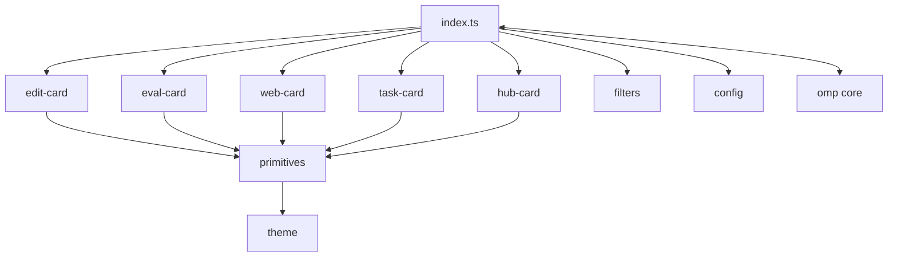
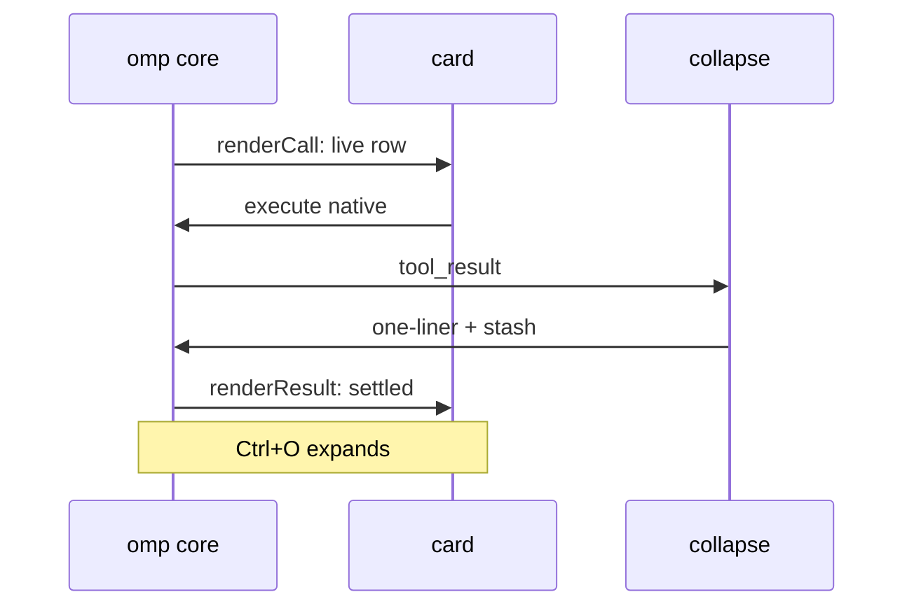
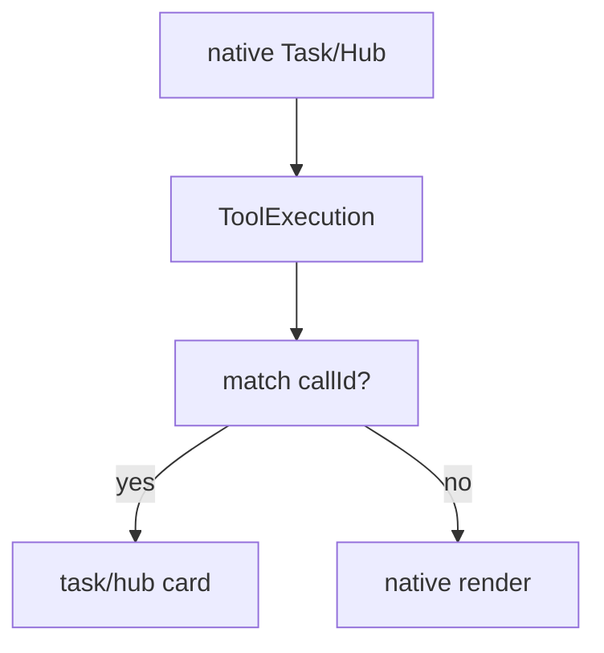
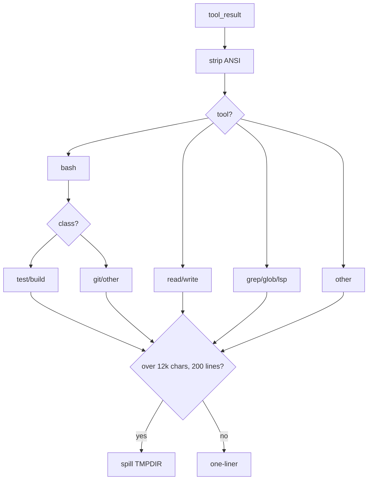

# omp-minimal-output — Software System Design

Display-only output skin for `omp`. Same tools, same execution. Smaller rows.

> Usage stays in `README.md`. This file is design only.
> Approved detail-level design (not implemented) lives in `DETAIL_LEVELS.md`.
> Examples live in `EXAMPLES.md`.

## 1. Purpose and scope

`omp-minimal-output` repaints tool rows in the transcript:

- One settled row per tool call (`◆` one-liner + duration).
- `Ctrl+O` (`app.tools.expand`) reveals details. No per-row click path — renderers are display-only.
- Thoughts hidden. Spillovers go to `$TMPDIR/omp-minimal-*.log`.

Out of scope: changing what any tool does, its schema, approvals, or result data.

## 2. Goals / non-goals

| Goals                                   | Non-goals                          |
| --------------------------------------- | ---------------------------------- |
| Merge call + result into one row        | New tool behavior or parameters    |
| Keep collapsed rows scannable           | Raw output in the transcript       |
| Fail open to native renderer            | Custom approval or execution paths |
| One setting per card (`native*`, limit) | Global "render anything" DSL       |

## 3. Context

Two tool families, two skins:

- **8 shadows** (`bash`, `read`, `grep`, `glob`, `write`, `edit`, `eval`, `web_search`): re-registered with native schema, delegate via `ctx.invokeTool`.
- **2 observed** (`task`, `hub`): stay native. `native-tool-card-skin.ts` observes `ToolExecutionComponent` and projects state. Never copied schema, never replaced approval.

Plus three chrome skins: read-group, warning, todo.

## 4. Architecture

`index.ts` owns wiring (`CARD_RENDERERS`, `tryWrapTool`, `collapseToolText`, skin installs).
Cards own meaning. `card-primitives.ts` owns mechanics. `theme.ts` owns paint.

## 5. Runtime

### 5.1 Wrapped tool lifecycle

Live rows pulse `◈ → ◉ → ◎ → ○` at 120 ms. Settled rows use the configured indicator (`◆` default); web search, Task, Hub settle to `●`. Errors use the error token.

### 5.2 Task / Hub observed path

Match keys: exact `toolCallId` identity first, then `isTaskCardData` / `isHubCardData` shape checks. Anything uncertain renders native.

### 5.3 Collapse pipeline (`filters.ts`)

Contract: line 1 is always the collapsed row. Dedicated cards (`edit`, `eval`, `web_search`, Task, Hub) expand from stashed text or structured native details, not the one-liner.

## 6. Card catalog

| Card       | Collapsed                                    | Expanded                                          | Limit                 |
| ---------- | -------------------------------------------- | ------------------------------------------------- | --------------------- |
| Bash test  | `◆ bash \`cmd\` — Tests: P passed, F failed` | failure lines + summary                           | spill cap             |
| Bash build | `◆ bash \`cmd\` — E errors, W warnings`      | error lines + head/tail                           | spill cap             |
| Bash git   | `◆ git sub — stat`                           | kept lines                                        | spill cap             |
| Read       | `◆ Read path`                                | full text behind `Ctrl+O`                         | spill cap             |
| Write      | `◆ Write path`                               | full text behind `Ctrl+O`                         | spill cap             |
| Grep / LSP | `◆ Search \`pat\` — F files, H hits`         | per-file groups, ≤3 lines each                    | spill cap             |
| Glob       | `◆ Glob \`pat\` — N files`                   | path list                                         | spill cap             |
| Edit       | `Edit path — +a/−b`                          | gutter diff, syntax-colored                       | 10 rows / 60 expanded |
| Eval       | `🐍 title / first line`                      | input 3→60, output 5→60                           | see row               |
| Web search | `Search \`q\` — N sources`                   | bold titles + dim URLs                            | `webSearchMaxResults` |
| Task       | `Task N agents — completed`                  | agent / status / task / output / error / artifact | `taskMaxAgents`       |
| Hub        | `Hub op target — summary`                    | peer / job / message rows                         | `hubMaxItems`         |
| Read group | `◆ Read N files`                             | one row per file                                  | —                     |

Running rows replace the summary with `running` + elapsed. Error rows keep the header and add red detail lines. See `EXAMPLES.md` for literal rows.

## 7. Config (`config.ts` + `package.json`)

| Setting                                               | Default           | Effect                                             |
| ----------------------------------------------------- | ----------------- | -------------------------------------------------- |
| `nativeBash/Read/Grep/Glob/Write/Edit/Eval/WebSearch` | `false`           | `true` restores native renderer per tool           |
| `nativeTask`                                          | `false`           | `true` restores native Task, result text untouched |
| `taskMaxAgents`                                       | `4` (`1..8`)      | expanded agent rows                                |
| `nativeHub`                                           | `false`           | `true` restores native Hub                         |
| `hubMaxItems`                                         | `5` (`1..10`)     | expanded Hub rows                                  |
| `webSearchMaxResults`                                 | `5` (`1..10`)     | expanded sources                                   |
| `indicator`                                           | `diamond`         | `◈◉◎○` live, `◆` settled                           |
| `indicatorAnimation`                                  | `true`            | spin pump on/off                                   |
| `opacity`                                             | `0.5`             | row dim blend                                      |
| `todosHeader` / `todoHud` / `todoReminderOneLine`     | `true/false/true` | todo chrome                                        |
| `editShowTabs` / `editShowSpaces`                     | `true/false`      | whitespace glyphs in diff                          |

Source of truth: `~/.omp/plugins/omp-plugins.lock.json` + project overrides. Read live at render time; no restart for most toggles.

## 8. Safety

- Shadows forward the exact native `parameters` object. No hand-written schema.
- Only static-approval tools are wrapped (`glob`→read, `eval`→exec, `web_search`→read). Dynamic-policy tools are never added.
- Task/Hub: no registration, no schema copy, no approval path. Hub's argument-dependent policy untouched.
- Every card renderer try/catches to a one-line fallback, then to native.
- Control bytes (ESC, OSC, C0/C1) sanitized before paint. Width truncation is ANSI-aware.
- Grouped reads share one parent row; settled records freeze `label/total/runId` so rebuilds never mirror a later run.

## Appendix A. Files

| File                                                                    | Owns                                                                 |
| ----------------------------------------------------------------------- | -------------------------------------------------------------------- |
| `index.ts`                                                              | entry, `CARD_RENDERERS`, `tryWrapTool`, collapse hook, skin installs |
| `filters.ts`                                                            | pure collapse one-liners + truncation/spill                          |
| `edit-card.ts` / `eval-card.ts` / `web-search-card.ts`                  | wrapped-tool cards                                                   |
| `task-card.ts` / `hub-card.ts`                                          | native-state projections                                             |
| `native-tool-card-skin.ts`                                              | fail-open `ToolExecutionComponent` bridge                            |
| `card-primitives.ts`                                                    | lifecycle, header, detail, error, limit helpers                      |
| `theme.ts` / `text.ts` / `results.ts` / `loaders.ts`                    | paint, labels, result readers, lazy core hooks                       |
| `read-group.ts` / `warning-skin.ts` / `todos-header.ts` / `todo-hud.ts` | group + alert + todo chrome                                          |
| `card-gallery.ts`                                                       | deterministic fixtures (running / success / error / expanded)        |
| `config.ts` / `package.json` / `minimal-output.yml`                     | settings, entry, host flags                                          |

## Appendix B. Glossary

- **Shadow**: re-registered tool with native schema that delegates execution and only changes rendering.
- **Observed**: native tool left registered; skin projects its component state.
- **One-liner**: collapsed row, line 1 of collapsed text.
- **Stash**: `details.minimalFullText`, full text saved pre-collapse for `Ctrl+O`.
- **Fail open**: any card error renders native instead of breaking the transcript.
