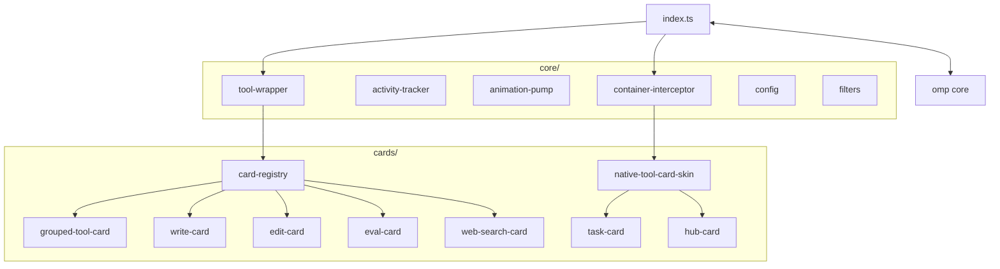
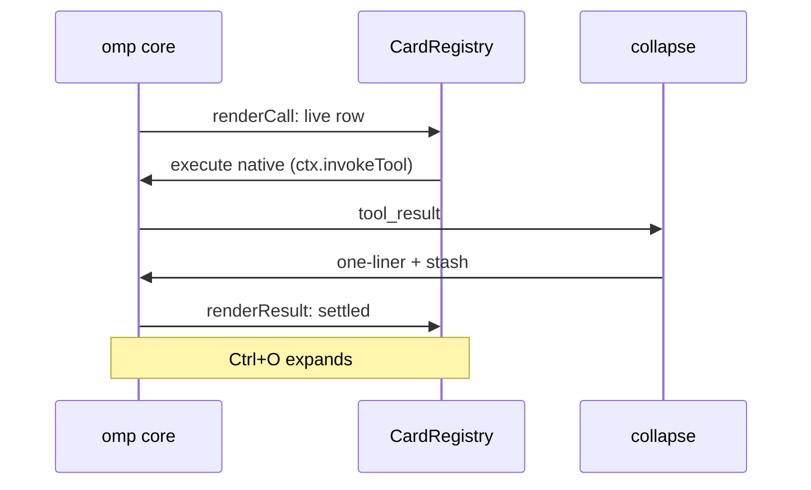
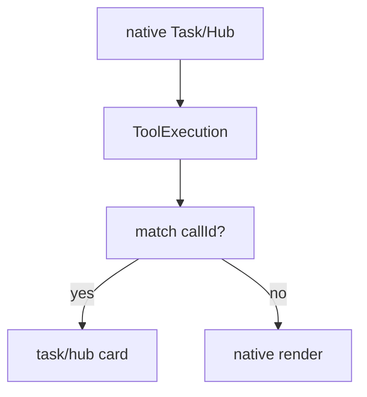
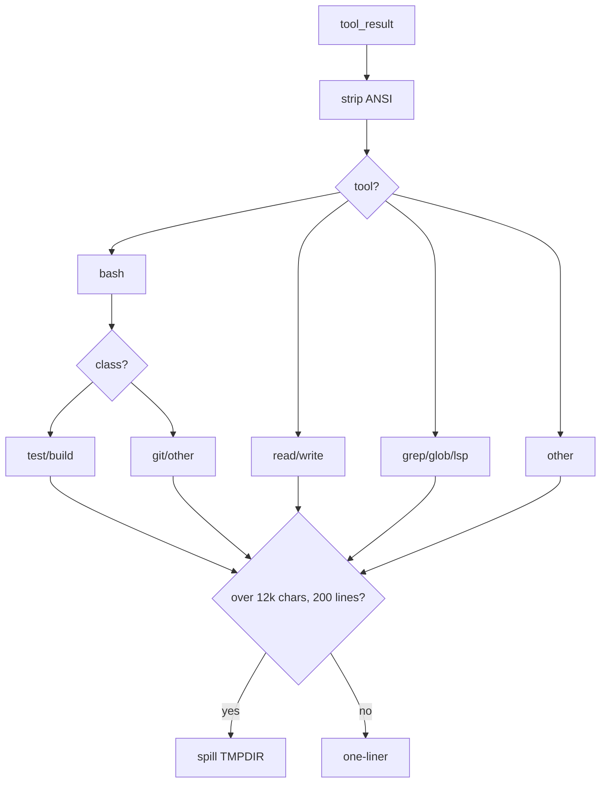

# omp-minimal-output — Software System Design

Display-only output skin for `omp`. Same tools, same execution. Smaller rows.

> Usage stays in `README.md`. This file is design only.
> The implemented detail-level contract lives in [`DETAIL_LEVELS.md`](DETAIL_LEVELS.md).
> Examples live in [`EXAMPLES.md`](EXAMPLES.md).

## 1. Purpose and scope

`omp-minimal-output` repaints tool rows in the transcript:

- One settled row per tool call (`◆` one-liner + duration) dispatched by `CardRegistry`.
- `Ctrl+O` (`app.tools.expand`) reveals details globally. `/inspect` (`ctrl+alt+i`) outlines one replica card. No per-row click path — renderers are display-only.
- Live reasoning streams in the widget above the editor; `hideThinkingBlock: true` (default in `minimal-output.yml`) hides the native thinking block and suppresses settled thought rows. Spillovers go to `$TMPDIR/omp-minimal-*.log`.

Out of scope: changing what any tool does, its schema, approvals, or result data.

## 2. Goals / non-goals

| Goals                                   | Non-goals                          |
| --------------------------------------- | ---------------------------------- |
| Merge call + result into one row        | New tool behavior or parameters    |
| Keep collapsed rows scannable           | Raw output in the transcript       |
| Fail open to native renderer            | Custom approval or execution paths |
| One setting per card (`native*`, limit) | Global "render anything" DSL       |

## 3. Context

Two tool families, two skins:

- **8 shadows** (`bash`, `read`, `grep`, `glob`, `write`, `edit`, `eval`, `web_search`): re-registered with native schema, delegate via `ctx.invokeTool`, and dispatch all rendering through `CardRegistry`.
- **2 observed** (`task`, `hub`): stay native. `cards/native-tool-card-skin.ts` observes `ToolExecutionComponent` and projects state. Never copied schema, never replaced approval.

Plus chrome skins: read-group, warning, assistant-commentary, and todo HUD — all subscribed through one `ContainerInterceptor`.

## 4. Architecture

`index.ts` owns wiring only. `core/tool-wrapper.ts` wraps tools and delegates rendering to `CardRegistry`; the registry dispatches grouped (`bash`/`read`/`grep`/`glob`) and dedicated adapters through one `render(context)` interface. Cards own meaning; `cards/card-primitives.ts` owns mechanics; `core/theme.ts` owns paint.

## 5. Runtime

### 5.1 Wrapped tool lifecycle

Live rows pulse `◈ → ◉ → ◎ → ○` at 120 ms. Settled rows use the configured indicator (`◆` default); web search, Task, Hub settle to `●`. Errors use the error token.

`CardRegistry.render` throws a native-fallback error when the plugin is disabled, a `native*` setting wins, or an adapter throws; OMP's host renderer catches construction/deferred errors and restores native output. Returning a falsy component would instead suppress the transcript, so the registry never does that.

### 5.2 Task / Hub observed path

Match keys: exact `toolCallId` identity first, then `isTaskCardData` / `isHubCardData` shape checks. Anything uncertain renders native.

### 5.3 Collapse pipeline (`core/filters.ts`)

Contract: line 1 is always the collapsed row. Dedicated cards (`write`, `edit`, `eval`, `web_search`, Task, Hub) expand from stashed text or structured native details, not the one-liner. Content is selected before headers and hints are rendered; `detailedMaxRows` applies per input/output section or Edit file, and to complete item counts for structured cards.

## 6. Card catalog

| Card       | Collapsed                                    | Expanded                                            | Limit                                         |
| ---------- | -------------------------------------------- | --------------------------------------------------- | --------------------------------------------- |
| Bash test  | `◆ bash \`cmd\` — Tests: P passed, F failed` | failure lines + summary                             | spill cap                                     |
| Bash build | `◆ bash \`cmd\` — E errors, W warnings`      | error lines + head/tail                             | spill cap                                     |
| Bash git   | `◆ git sub — stat`                           | kept lines                                          | spill cap                                     |
| Read       | `◆ Read path`                                | bounded content preview                             | `detailedMaxRows`                             |
| Write      | `◆ Write path — N lines`                     | latest content lines + `(...N previous lines)` hint | `standardWriteMaxRows` / `detailedMaxRows`    |
| Grep       | `◆ Search \`pat\` — F files, H hits`         | bounded result text                                 | `detailedMaxRows` content                     |
| Glob       | `◆ Glob \`pat\` — N files`                   | bounded path list                                   | `detailedMaxRows`                             |
| Edit       | `Edit path — +a/−b`                          | bounded gutter diff, syntax-colored                 | `standardEditRowsPerFile` / `detailedMaxRows` |
| Eval       | `🐍 title / first line`                      | bounded input and output                            | `detailedMaxRows`                             |
| Web search | `Search \`q\` — N sources`                   | bounded bold titles + dim URLs                      | `webSearchMaxResults` / `detailedMaxRows`     |
| Task       | `Task N agents — completed`                  | bounded agent / status / result rows                | `taskMaxAgents` / `detailedMaxRows`           |
| Hub        | `Hub op target — summary`                    | bounded peer / job / message rows                   | `hubMaxItems` / `detailedMaxRows`             |
| Read group | `● Read N files`                             | bounded file list                                   | `detailedMaxRows`                             |

LSP, AST-grep, and Debug retain native Standard/Detailed rendering because their rendered rows do not expose reliable content boundaries. Minimal retains its existing single-row projection. Dedicated running rows show the live indicator and elapsed time; error rows retain identity and bounded failure detail. See [`EXAMPLES.md`](EXAMPLES.md) for row shapes.

## 7. Config (`core/config.ts` + `package.json`)

| Setting                                               | Default           | Effect                                                                |
| ----------------------------------------------------- | ----------------- | --------------------------------------------------------------------- |
| `nativeBash/Read/Grep/Glob/Write/Edit/Eval/WebSearch` | `false`           | `true` restores native renderer per tool                              |
| `nativeTask`                                          | `false`           | `true` restores native Task, result text untouched                    |
| `taskMaxAgents`                                       | `4` (`1..8`)      | Standard Task item selection                                          |
| `nativeHub`                                           | `false`           | `true` restores native Hub                                            |
| `hubMaxItems`                                         | `5` (`1..10`)     | Standard Hub item selection                                           |
| `webSearchMaxResults`                                 | `5` (`1..10`)     | Standard source selection                                             |
| `detailedMaxRows`                                     | `20` (`1..100`)   | Detailed/Ctrl+O content per section/file or complete structured items |
| `indicator`                                           | `diamond`         | `◈◉◎○` live, `◆` settled                                              |
| `indicatorAnimation`                                  | `true`            | spin pump on/off                                                      |
| `opacity`                                             | `0.5`             | row dim blend                                                         |
| `detailLevel`                                         | `standard`        | minimal / standard / detailed density                                 |
| `standardMaxRows` / `standardOutputMaxRows`           | `3` / `4`         | Independent Standard input/output content allowances                  |
| `standardEditRowsPerFile` / `standardWriteMaxRows`    | `10` / `10`       | Per-file Edit content / latest Write content lines                    |
| `todosHeader` / `todoHud` / `todoReminderOneLine`     | `true/false/true` | todo chrome                                                           |
| `editShowTabs` / `editShowSpaces`                     | `true/false`      | whitespace glyphs in diff                                             |
| `composerRefreshInterval`                             | `60` (`1..3600`)  | composer status refresh polling seconds                               |

Source of truth: `~/.omp/plugins/omp-plugins.lock.json` + project overrides (`.omp/plugin-overrides.json`, `.pi/plugin-overrides.json`). Read live at render time; `turn_end` reloads on file mtime changes.

## 8. Safety

- Shadows forward the exact native `parameters` object. No hand-written schema.
- Only static-approval tools are wrapped (`glob`→read, `eval`→exec, `web_search`→read). Dynamic-policy tools are never added.
- Task/Hub: no registration, no schema copy, no approval path. Hub's argument-dependent policy untouched.
- Registry and card renderers throw on failure; the host catch restores native rendering. Deferred render errors stay protected by the host's safe renderer.
- Control bytes (ESC, OSC, C0/C1) sanitized before paint. Width truncation is ANSI-aware.
- Grouped reads share one parent row; settled records freeze `label/total/runId` so rebuilds never mirror a later run.
- One `core/container-interceptor.ts` owns `Container.prototype.addChild`; skins register subscribers with idempotent cleanup and never overwrite another extension's hook.

## Appendix A. Files

| File                                                                           | Owns                                                          |
| ------------------------------------------------------------------------------ | ------------------------------------------------------------- |
| `index.ts`                                                                     | entry, wiring, skin installs, interceptor lifecycle           |
| `core/tool-wrapper.ts`                                                         | tool wrapping, native delegation, collapse hook               |
| `core/card-registry.ts` → `cards/card-registry.ts`                             | unified card dispatch (grouped + dedicated adapters)          |
| `core/container-interceptor.ts`                                                | single `addChild` seam, subscriber registry                   |
| `core/filters.ts`                                                              | pure collapse one-liners + truncation/spill                   |
| `cards/write-card.ts` / `edit-card.ts` / `eval-card.ts` / `web-search-card.ts` | wrapped-tool cards                                            |
| `cards/task-card.ts` / `cards/hub-card.ts`                                     | native-state projections                                      |
| `cards/native-tool-card-skin.ts`                                               | fail-open `ToolExecutionComponent` bridge                     |
| `cards/card-primitives.ts`                                                     | lifecycle, header, detail, error, limit helpers               |
| `core/theme.ts` / `core/text.ts` / `core/results.ts` / `core/loaders.ts`       | paint, labels, result readers, lazy core hooks                |
| `surfaces/read-group.ts` / `surfaces/warning-skin.ts` / `surfaces/todo-hud.ts` | group + alert + todo chrome                                   |
| `cards/card-gallery.ts`                                                        | deterministic fixtures (running / success / error / expanded) |
| `core/config.ts` / `package.json` / `minimal-output.yml`                       | settings, entry, host flags                                   |

## Appendix B. Glossary

- **Shadow**: re-registered tool with native schema that delegates execution and only changes rendering.
- **Observed**: native tool left registered; skin projects its component state.
- **One-liner**: collapsed row, line 1 of collapsed text.
- **Stash**: `details.minimalFullText`, full text saved pre-collapse for `Ctrl+O`.
- **Fail open**: any card error reaches the host catch, which restores the native transcript instead of hiding output.
